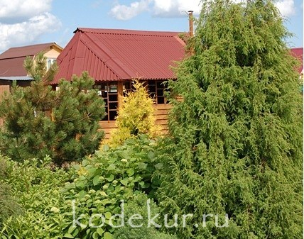

<b>
 Главная 
</b>
 
 
 

<b>Коллекция Декоративных КультуР (КОДЕКУР) является частной и размещена во Владимирской области вблизи города Киржача.   Все растения выращиваются своими силами на площади около 30 соток. Коллекция начала формироваться с 2002 года и в настоящее время содержит около  2 000 таксонов многолетних декоративных растений для открытого грунта. Все размещённые на сайте растения адаптированы к климату средней полосы России. 
  С ПОРЯДКОМ ЗАКАЗА РАСТЕНИЙ МОЖНО ОЗНАКОМИТЬСЯ В РАЗДЕЛЕ <a title="Ассортимент на 2025 год"href="KODEKUR_Price.html"target=_blank>АССОРТИМЕНТ НА  2025 ГОД</a> .
 Отдельные культуры размножены в количестве, достаточном для оптовой реализации. С порядком заказа оптовых партий можно знакомиться в разделе <b><a href="/opt.html"target="_blank">ДЛЯ ОПТОВИКОВ</a></b>. 
  Подробное описание и фотографии  растений из моей коллекции представлены в разделах Каталога : <b><a href="/arbustum.html"> ДЕКОРАТИВНЫЕ КУСТАРНИКИ </a>, <a href="/herbs.html"> ДЕКОРАТИВНЫЕ ТРАВЫ </a>,  <a href="/mnogoletnije.html"> МНОГОЛЕТНИЕ РАСТЕНИЯ </a> и <a href="/conifer.html">ХВОЙНЫЕ</a>.   В разделе <a href="/contacts.html"> КОНТАКТЫ </a> найдёте информацию о том, как меня найти. Все фотографии выполнены только на собственном участке  и при их использовании ссылка на мой сайт обязательна.  ДЛЯ ПОИСКА НУЖНОГО РАСТЕНИЯ МОЖНО ИСПОЛЬЗОВАТЬ ПОИСКОВИК ПО САЙТУ, КОТОРЫЙ НАХОДИТСЯ СЛЕВА НИЖЕ МЕНЮ. </b> 
  Постепенно количество отдельных культур стало настолько представительным, что их можно выделить в отдельные коллекции:</b>
 
                                    

<table>
    <tr>
        <td width="100px"> 	</td>
        <td width="100px"> 	</td>
        <td width="100px"> </td>
        <td width="100px"> 	</td>
        <td width="100px"> </td>
        <td width="100px"> </td>
        <td width="100px"> 	</td>
        <td width="100px"> </td>
    </tr>
    <tr>
        <td>
<b><a href="/mnogoletnije_files/astilbe.html">астильбы</a></b>
</td>
        <td>
<b><a href="/mnogoletnije_files/heuchera.html">гейхеры</a></b>
</td>
        <td>
<b><a href="/mnogoletnije_files/geranium.html">герани</a></b>
</td>
        <td>
<b><a href="/mnogoletnije_files/hemerocallis.html">лилейники</a></b>
</td>
        <td>
<b><a href="/mnogoletnije_files/paeonia.html">пионы</a></b>
</td>
        <td>
<b><a href="/mnogoletnije_files/primula.html">примулы</a></b>
</td>
        <td>
<b><a href="/mnogoletnije_files/phlox.html">флоксы </a></b>
</td>
        <td>
<b><a href="/mnogoletnije_files/hosta.html">хосты</a></b>
</td>
    </tr>
</table>

 
<b>
Связаться со мной можно  по телефону: +7 (916) 279 74 95, по e-mail: <a href='mailto:kodekur@yandex.ru' >kodekur@yandex.ru</a>, а также в социальных сетях:</b>  
<b>

</b>
